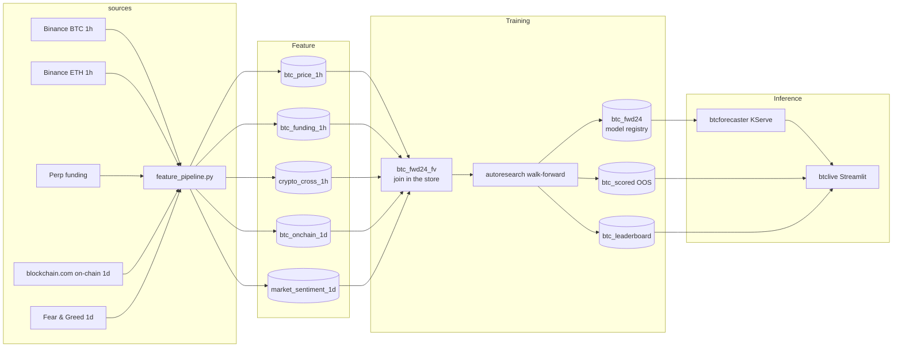
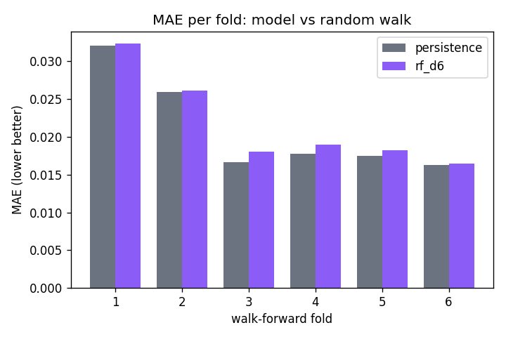
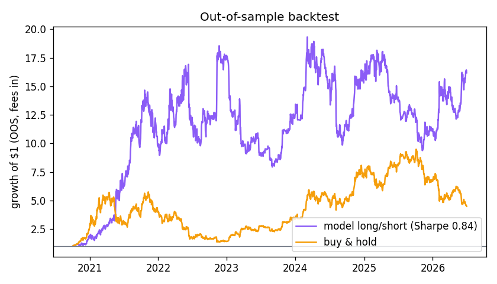
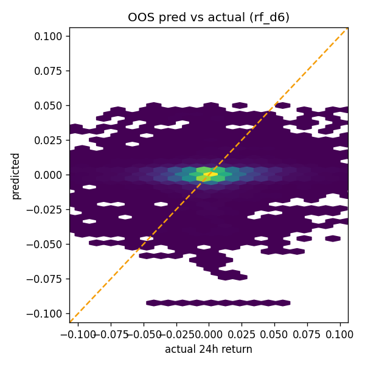
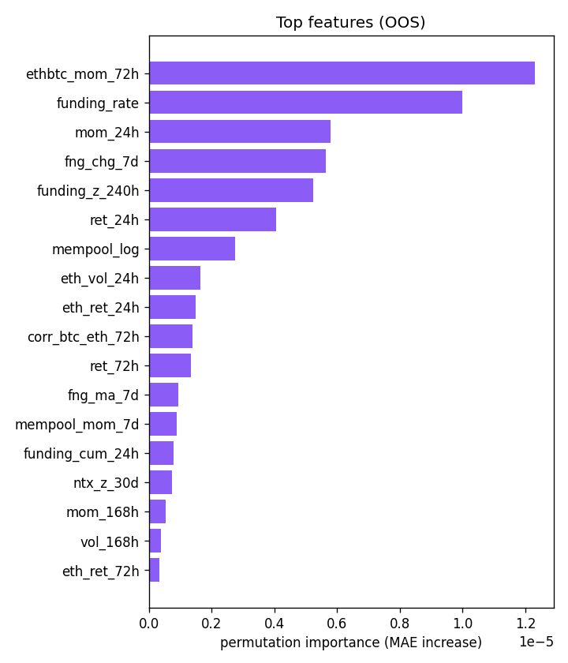

# btc-24h-forecast

Live BTC next-24h return forecaster on Hopsworks. Five public data sources, one
feature view, a walk-forward autoresearch loop, a KServe endpoint that rebuilds the
feature vector live, and a Streamlit front-end with a trade suggestion it politely
begs you not to follow.

> **THIS IS DANGEROUS AND NOT FINANCIAL ADVICE.** A model with a thin edge over a
> random walk still loses often. This is an ML systems demo, not a strategy.

## System



The five feature groups each keep their own cadence; the **feature view owns the
join** (hourly on `open_time`, daily on a lagged day key -- a bar on day D reads day
D-1's on-chain/sentiment values, publication lag baked into the key). The serving
endpoint rebuilds the identical 46-feature vector from the same shared modules,
live, at request time.

## Results (walk-forward, out-of-sample)

**The random walk wins.** Over ~57,000 hourly bars (Oct 2019 - Jun 2026), no model
in the search beats the persistence baseline (predict zero) on MAE:

| round | configs | best MAE | baseline MAE | lift | best dir-acc |
|---|---|---|---|---|---|
| 1: MSE losses | ridge, RF x2, HGB x2, XGB | 0.02168 (rf_d6) | 0.02104 | **-3.1%** | 52.4% |
| 2: MAE losses | HGB-mae x3, XGB-mae + refs | 0.02168 (rf_d6) | 0.02104 | **-3.1%** | 52.6% |

Two honest findings instead of one fake one:

1. **Loss must match the metric.** Round 1's MSE learners predict the conditional
   mean while MAE rewards the median (~0 for BTC); the more expressive the model,
   the more variance it chased and the worse it got (HGB: -17.5%). Round 2 fixed
   the loss (`absolute_error`) and the gap closed to a few percent -- but never
   turned positive.
2. **There is a sliver of direction, no magnitude.** MAE-loss models reach ~52.6%
   directional accuracy out-of-sample (coin flip = 50%), yet still cannot price
   *how far* the market moves. 46 causal features from five sources do not beat
   an irrational market at 24h horizon. Anyone claiming otherwise on public data
   is leaking the future.
3. **What little signal exists is exogenous.** Permutation importance ranks the
   cross-market and positioning features first (ETHBTC momentum, funding rate,
   Fear & Greed 7-day change, mempool size) -- ahead of every price technical.
   The multi-source thesis holds; the market just does not pay much for it.






Every number is walk-forward (`TimeSeriesSplit`, 24-bar embargo -- the label spans
24 bars, a shuffled K-fold would leak). The backtest is non-overlapping and pays 4
bps per position flip. See [docs/HONESTY.md](docs/HONESTY.md) for what this does
and does not claim.

## Features (46, all causal)

| block | features | source |
|---|---|---|
| technicals (23) | multi-lag returns, rolling vol, MA momentum, RSI, volume z, ranges, calendar | Binance BTC 1h |
| funding (5) | rate, 72h mean, 240h z, 24h cum, positive-share | Binance perp |
| cross (6) | ETH returns, BTC-ETH spread, ETHBTC momentum, ETH vol, rolling corr | Binance ETH 1h |
| on-chain (7) | hashrate, difficulty, tx count, mempool, miners revenue (levels+momenta) | blockchain.com |
| sentiment (5) | Fear & Greed level, changes, trend, distance from neutral | alternative.me |

Open interest / long-short ratios are deliberately absent: Binance retains only 30
days, which cannot support multi-year training. They belong to a v2 online FG.

## Run it

```bash
make features      # ingest all five sources into their FGs (~7 years hourly)
make train-job     # walk-forward autoresearch as a Hopsworks job -> champion + images
make serve         # deploy the champion as the btcforecaster KServe endpoint
make app           # deploy the Streamlit front-end
make smoke         # poke the endpoint
```

Schedule `pipelines/feature_pipeline.py` hourly (`hops job schedule`) to keep the
store fresh; the endpoint pulls its trailing window live and needs no refresh.
